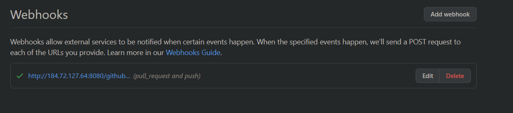

# Assignment3: Continous Integration

<h2 class="code-line" data-line-start=1 data-line-end=2 >Output</h2>
<h3 class="code-line" data-line-start=3 data-line-end=4 >Output1:</h3>

<strong>3 stages:</strong> 

<h3 class="code-line" data-line-start=7 data-line-end=8 >Output2:</h3>

<strong>Final Output</strong> 

<h3 class="code-line" data-line-start=11 data-line-end=12 >Output3:</h3>

<strong>Webhook for the Jenkins Job</strong> 

<h3 class="code-line" data-line-start=15 data-line-end=16 >Output4:</h3>

<strong>Jenkins automatically triggered the Github repo while changes has occured on the items.yaml file</strong> 
<strong>I have added a category named “fruits” in the items.yaml file</strong> 

